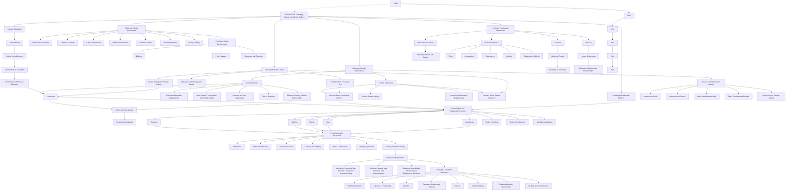

```mermaid


flowchart TD
    A["2000 to 2026: Changing Sexual and Gender Culture"] --> B["Internet Expansion"]
    A --> C["Sexualized Media Culture"]
    A --> D["Changing Gender Expectations"]
    A --> E["Changing Relationship Patterns"]

    B --> B1["Early Internet"]
    B1 --> B2["Online Sexual Content"]
    B2 --> B3["Greater Sexual Availability"]
    B3 --> B4["Private and Solo Sexual Behaviour"]

    C --> C1["Normalization of Casual Sex"]
    C --> C2["Sexualized Advertising and Media"]
    C --> C3["Online Dating and Hookup Culture"]

    D --> M["Male Experience"]
    M --> M1["Traditional Masculine Expectations"]
    M --> M2["Men Viewed Through Risk and Predator Lens"]
    M --> M3["Pressure to Prove Masculinity"]
    M --> M4["Fear of Rejection"]
    M --> M5["Loneliness"]
    M --> M6["Difficulty Forming Intimate Relationships"]

    B4 --> M5
    C3 --> M5
    M5 --> M7["Online and Solo Coping"]
    M6 --> M7
    M7 --> M8["Emotional Withdrawal"]

    D --> F["Female Experience"]
    F --> F1["Greater Sexual Agency"]
    F --> F2["Changing Relationship Expectations"]
    F --> F3["Greater Online Sexual Exposure"]
    F --> F4["Pressure From Sexualized Culture"]

    C --> F3
    C1 --> F4

    D --> S["Sexual Orientation and Identity"]
    S --> S1["Heterosexual Male"]
    S --> S2["Heterosexual Female"]
    S --> S3["Same Sex Attracted Male"]
    S --> S4["Same Sex Attracted Female"]
    S --> S5["Questioning or Gender Identity"]

    M5 --> P["Psychological and Relational Pressures"]
    F4 --> P
    E --> P

    P --> P1["Rejection"]
    P --> P2["Bullying"]
    P --> P3["Shame"]
    P --> P4["Fear"]
    P --> P5["Heartbreak"]
    P --> P6["Desire for Safety"]
    P --> P7["Desire for Belonging"]
    P --> P8["Need for Acceptance"]

    P1 --> R["Possible Coping Responses"]
    P2 --> R
    P3 --> R
    P4 --> R
    P5 --> R

    R --> R1["Withdrawal"]
    R --> R2["Serial Relationships"]
    R --> R3["Sexual Behaviour"]
    R --> R4["Celibacy and Virginity"]
    R --> R5["Online Communities"]
    R --> R6["Identity Exploration"]
    R --> R7["Seeking Emotional Safety"]

    A --> H["Child and Family Environment"]
    H --> H1["Heterosexual Parents"]
    H --> H2["Same Sex Parents"]
    H --> H3["Father Relationship"]
    H --> H4["Mother Relationship"]
    H --> H5["Parental Conflict"]
    H --> H6["Parental Absence"]
    H --> H7["Family Stability"]
    H --> H8["Childhood Social Environment"]

    H8 --> H9["Bullying"]
    H8 --> H10["Peer Pressure"]
    H8 --> H11["Belonging and Rejection"]

    A --> T["Christian Theological Framework"]
    T --> T1["Creation"]
    T1 --> T2["Male and Female"]
    T2 --> T3["Marriage as Covenant"]
    T --> T4["The Fall"]
    T4 --> T5["Human Brokenness"]
    T5 --> T6["Disordered Desires and Relationships"]
    T --> T7["Biblical Sexual Ethics"]
    T7 --> T8["Sexuality Within Gods Design"]
    T --> T9["Pastoral Response"]
    T9 --> T10["Truth"]
    T9 --> T11["Compassion"]
    T9 --> T12["Repentance"]
    T9 --> T13["Healing"]
    T9 --> T14["Redemption in Christ"]

    R7 --> X["Proposed Interpretation"]
    X --> X1["Identity or Community May Become a Perceived Source of Safety"]
    X --> X2["Cultural Pressure May Influence Self Understanding"]
    X --> X3["Relational Wounds May Influence Later Relationship Behaviour"]

    X --> O["Possible Long Term Outcomes"]
    O --> O1["Healthy Attachment"]
    O --> O2["Marriage or Partnership"]
    O --> O3["Celibacy"]
    O --> O4["Repeated Relationship Patterns"]
    O --> O5["Isolation"]
    O --> O6["Identity Stability"]
    O --> O7["Continued Identity Questioning"]
    O --> O8["Healing and Reconciliation"]

    Y["2000"] --> Y1["2005"]
    Y1 --> Y2["2010"]
    Y2 --> Y3["2015"]
    Y3 --> Y4["2020"]
    Y4 --> Y5["2026"]
    Y -.-> A
```
